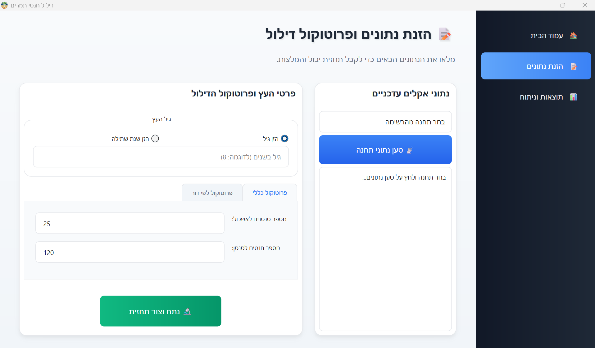

Project: Date Palm — Smart Agriculture Tools

Screenshots

Splash screen
This screenshot shows the application's startup splash screen.

Main application window
Main user interface screenshot.

Images are expected to be in the repository root next to this README.md.

Overview

I built a small prototype suite that processes weather station data, extracts agronomic features relevant to date-palm phenology, and provides a polished desktop UI with an animated splash screen and an example forecast-visualization. The codebase is organized into small, focused modules so I can iterate quickly on algorithms and UX independently.

What I implemented

data_processor.py

I implemented data parsing and sanitization for raw weather API responses, including timezone normalization and channel mapping.
I added physical constants and meteorological helpers (saturation vapor pressure, vapor pressure deficit, slope of saturation curve) and a Penman–Monteith based evaporation estimate at a 10-minute resolution.
I compute degree-hours above 18°C, clean negative sensor values, aggregate measurements, and summarize features across defined phenological periods (inflorescence differentiation, flowering, thinning, growth, June drop, ripening, harvest).
splash_screen.py

I created an animated QSplashScreen using PyQt6 with a stylized neural-network visual, pulsing logo, and a rotating circular loading indicator.
The animation runs at ~60 FPS and cycles through friendly loading messages.
main_application.py (excerpt)

I prepared a plotting routine that renders a normal-distribution forecast with shaded confidence bands and annotated mean yield.
How to run

Create a Python 3.10+ virtual environment and install dependencies:

pip install pandas numpy matplotlib pyqt6 scipy

Show the splash example:

python splash_screen.py

Run the main application (example):

python main_application.py
Notes and next steps

The data_processor expects the raw API to include channel entries with name, value, status, and datetime in ISO format.
I plan to add unit tests, more robust missing-data strategies, and a simple CLI or REST wrapper for batch processing.

